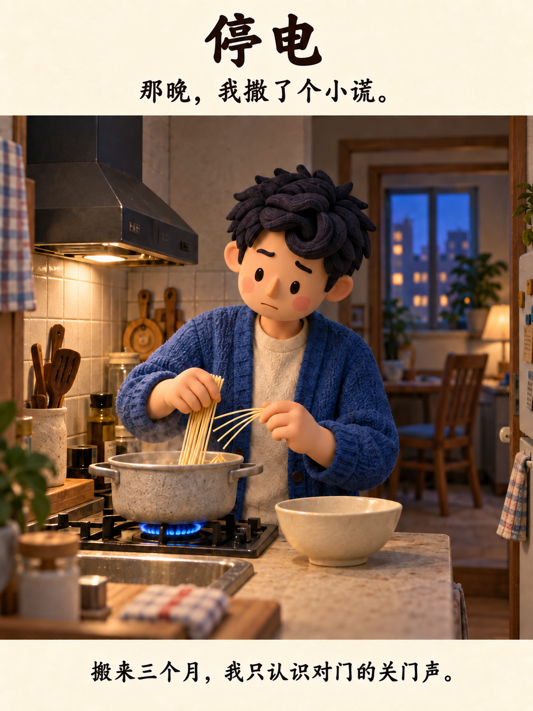

# 《停电》北欧风格都市绘本

《停电》（旧名《多出来的半碗面》）是一则关于成年邻居分享晚餐的都市治愈短篇。项目采用 3:4 竖版、一页一幕的 8 张轮播基线。

## 导航

- [当前状态与版本](CURRENT.md)
- [视觉风格规范](STYLE_GUIDE.md)
- [新对话交接说明](HANDOFF.md)
- [8 幕剧本与对白](episodes/01-tingdian/script.md)
- [轮播图册与追加变体](episodes/01-tingdian/README.md)
- [参考资料与致谢](references/README.md)

基线成图位于 [episodes/01-tingdian/images](episodes/01-tingdian/images)。原始提示词和历史输出保留在 [archive/original-comic](archive/original-comic)。
