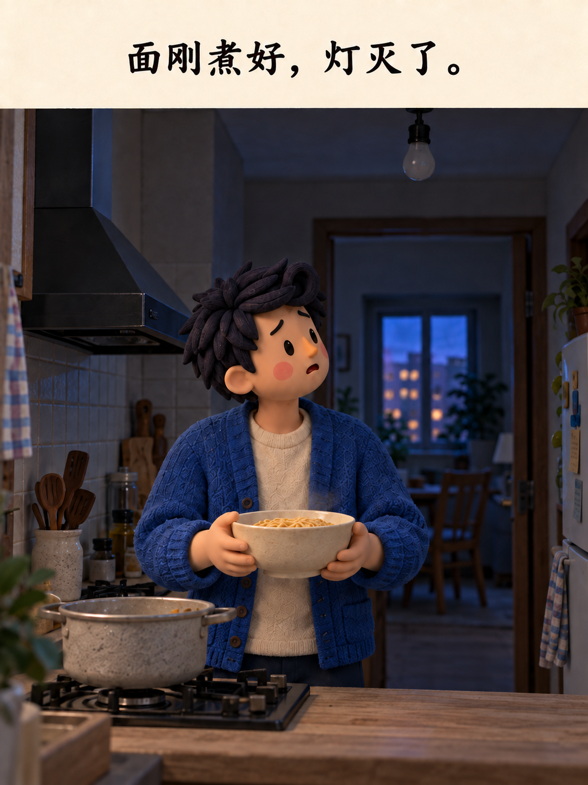
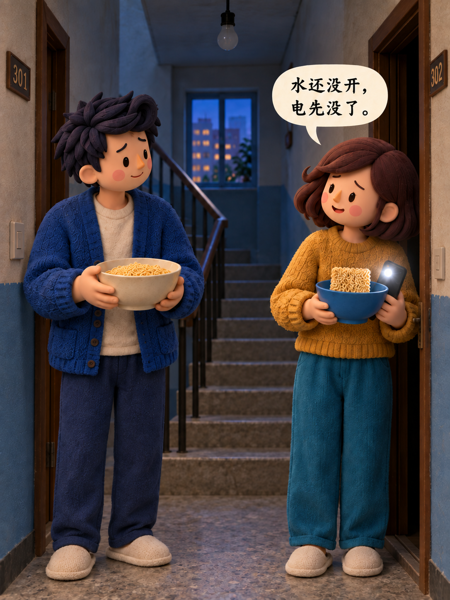
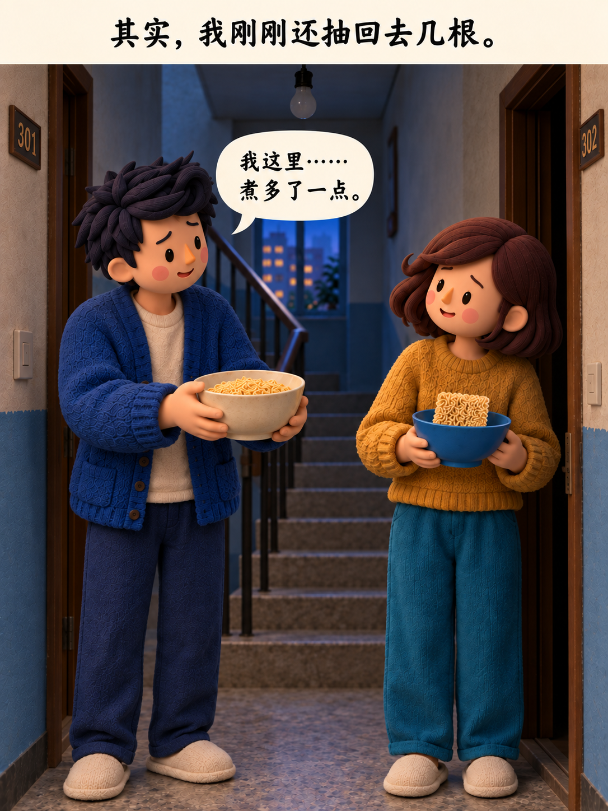
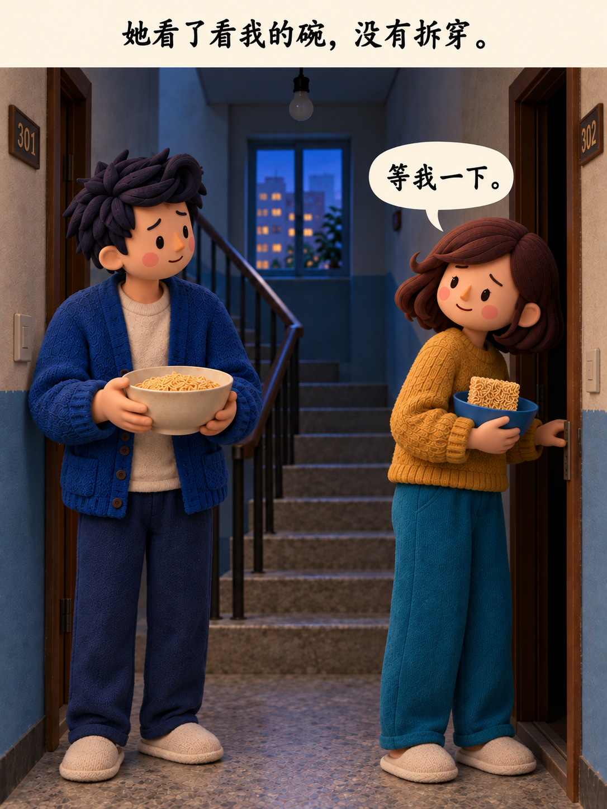
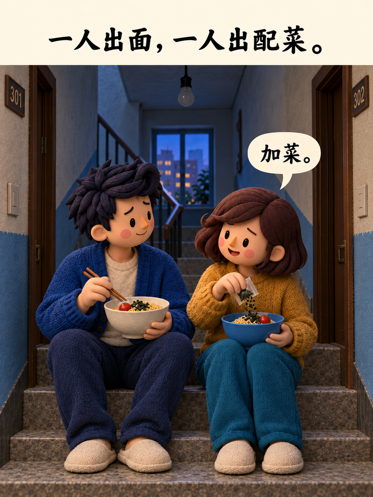
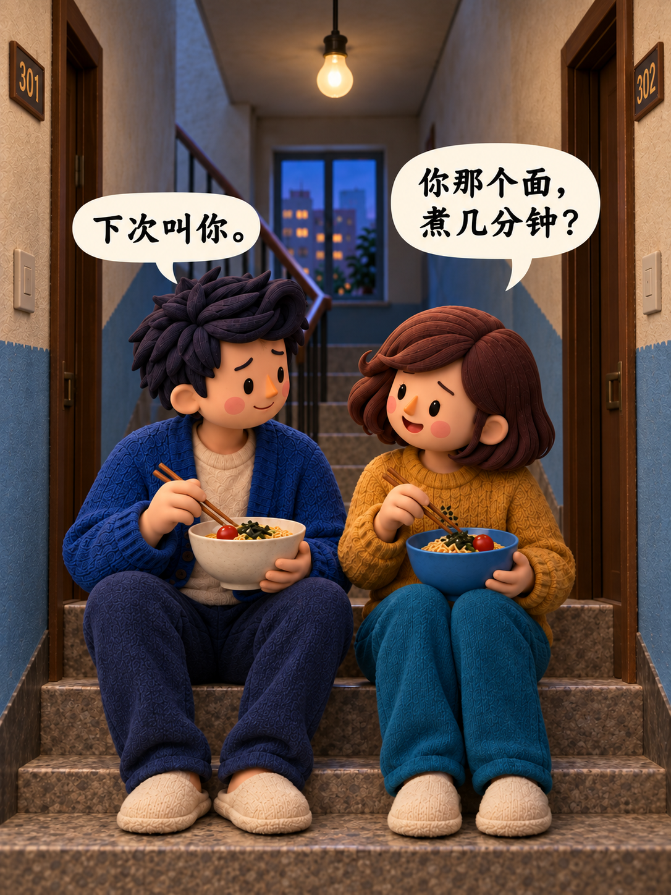

# 《停电》轮播图册

以下 8 张是当前整理的基线顺序。点击图片可查看原图；追加变体单独列在图册后，不改变基线页码。

1. 独自煮面：
2. 厨房停电：
3. 楼道相遇：
4. 提出分享：
5. 等我一下：
6. 分面加菜：
7. 楼道灯亮：
8. 下次叫你：

## 追加变体

- [火腿肠版](../../archive/original-comic/06-toppings-sausage.png)：女方对白“吃面怎么能少了这个！”。
- [火腿肠版去顶部横幅](../../archive/original-comic/numbered-edits/4.png)。
- [豪华大餐结尾对白版](../../archive/original-comic/numbered-edits/6.png)。

这些是已存在的独立成图，尚未记录为最终用户确认版。
